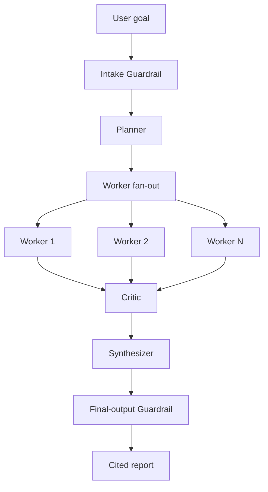

# Research & Report Agent

A Python + LangGraph multi-agent system that turns a broad research question into a cited report.

## Status

**Fullstack MVP.** The repository contains a Python/LangGraph orchestrator-worker runtime, FastAPI service, SQLite persistence, and React dashboard.

## What it will do

Given a research goal such as:

> Compare the top 3 EV battery chemistries for cost and safety.

the system will:

1. Apply an intake guardrail.
2. Plan 3–6 discrete research tasks.
3. Fan out worker agents with LangGraph.
4. Validate structured findings and sources.
5. Review quality with a critic agent.
6. Retry, revise, or re-plan within strict limits.
7. Synthesize a cited Markdown report.
8. Apply a final-output guardrail before delivery.
9. Stream live progress to the browser.
10. Display and download the cited Markdown report.

## Architecture



See the full design, contracts, retry policy, guardrail taxonomy, and acceptance criteria in [`docs/spec/design.md`](docs/spec/design.md).

## Tech stack

- Python 3.11+
- LangGraph
- Pydantic
- FastAPI
- SQLAlchemy
- React
- TypeScript
- Vite
- asyncio
- pytest
- Ruff

## Development setup

```bash
python3.11 -m venv .venv
source .venv/bin/activate
python -m pip install -e ".[dev]"
cd frontend
npm install
```

## Run locally

Start both services:

```bash
./scripts/dev.sh
```

- Frontend: http://127.0.0.1:5173
- Backend API: http://127.0.0.1:8000
- API docs: http://127.0.0.1:8000/docs

You can also run the services separately:

```bash
.venv/bin/python -m uvicorn research_report_agent.main:app --host 127.0.0.1 --port 8000
```

```bash
cd frontend
npm run dev
```

By default, the runtime uses deterministic local agents and a local evidence catalog. No model provider credential is required for the MVP smoke path.

## API surface

| Method | Path | Purpose |
|---|---|---|
| `POST` | `/api/runs` | Create and start a research run |
| `GET` | `/api/runs` | List runs |
| `GET` | `/api/runs/{run_id}` | Get run state |
| `DELETE` | `/api/runs/{run_id}` | Cancel an active run |
| `GET` | `/api/runs/{run_id}/tasks` | List planned tasks |
| `GET` | `/api/runs/{run_id}/attempts` | List immutable worker attempts |
| `GET` | `/api/runs/{run_id}/events` | Get event history |
| `GET` | `/api/runs/{run_id}/stream` | Live SSE progress stream |
| `GET` | `/api/runs/{run_id}/report` | Get structured report |
| `GET` | `/api/runs/{run_id}/report.md` | Download Markdown |
| `GET` | `/health` | Health check |

## Quality checks

```bash
ruff format --check .
ruff check .
pytest
cd frontend
npm run typecheck
npm run test -- --run
npm run build
```

The same checks run in GitHub Actions on every pull request.

## Repository standards

- Work on feature branches.
- Open pull requests into `main`.
- Require CI to pass before merge.
- Use squash merges.
- Keep commits focused and conventional.
- Do not commit secrets or API keys.
- Add or update tests with every behavior change.

## Documentation

- [Design specification](docs/spec/design.md)
- [Repository bootstrap plan](docs/plans/2026-08-16-repository-bootstrap.md)
- [Contributing guide](CONTRIBUTING.md)
- [Security policy](SECURITY.md)

## License

Released under the [MIT License](LICENSE).
