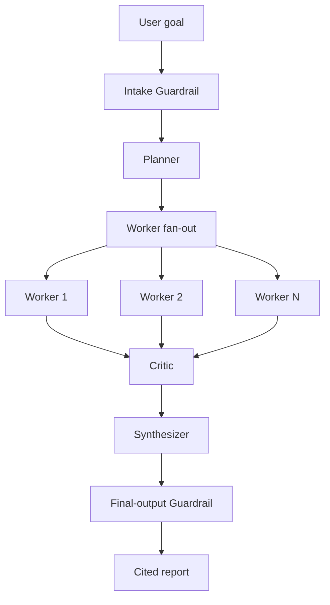

# Research & Report Agent

A Python + LangGraph multi-agent system that turns a broad research question into a cited report.

## Status

**Design phase.** The authoritative architecture is available in [`docs/spec/design.md`](docs/spec/design.md). The implementation will follow the milestones defined in the specification.

## What it will do

Given a research goal such as:

> Compare the top 3 EV battery chemistries for cost and safety.

the system will:

1. Apply an intake guardrail.
2. Plan 3–6 discrete research tasks.
3. Fan out worker agents with LangGraph.
4. Validate structured findings and sources.
5. Review quality with a critic agent.
6. Retry, revise, or re-plan within strict limits.
7. Synthesize a cited Markdown report.
8. Apply a final-output guardrail before delivery.

## Architecture



See the full design, contracts, retry policy, guardrail taxonomy, and acceptance criteria in [`docs/spec/design.md`](docs/spec/design.md).

## Tech stack

- Python 3.11+
- LangGraph
- Pydantic
- asyncio
- pytest
- Ruff

## Development setup

```bash
python3.11 -m venv .venv
source .venv/bin/activate
python -m pip install -e ".[dev]"
```

## Quality checks

```bash
ruff format --check .
ruff check .
pytest
```

The same checks run in GitHub Actions on every pull request.

## Repository standards

- Work on feature branches.
- Open pull requests into `main`.
- Require CI to pass before merge.
- Use squash merges.
- Keep commits focused and conventional.
- Do not commit secrets or API keys.
- Add or update tests with every behavior change.

## Documentation

- [Design specification](docs/spec/design.md)
- [Repository bootstrap plan](docs/plans/2026-08-16-repository-bootstrap.md)
- [Contributing guide](CONTRIBUTING.md)
- [Security policy](SECURITY.md)

## License

Released under the [MIT License](LICENSE).
